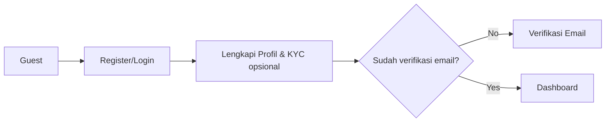
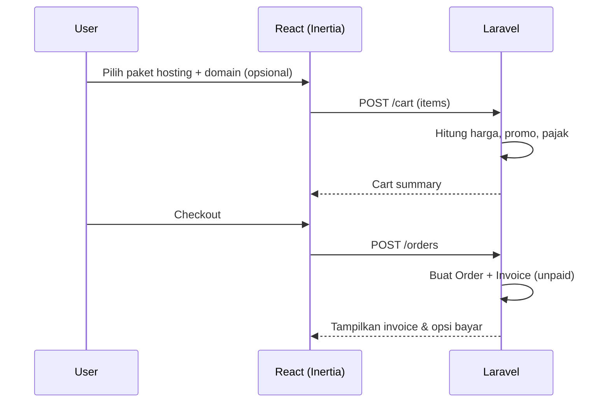
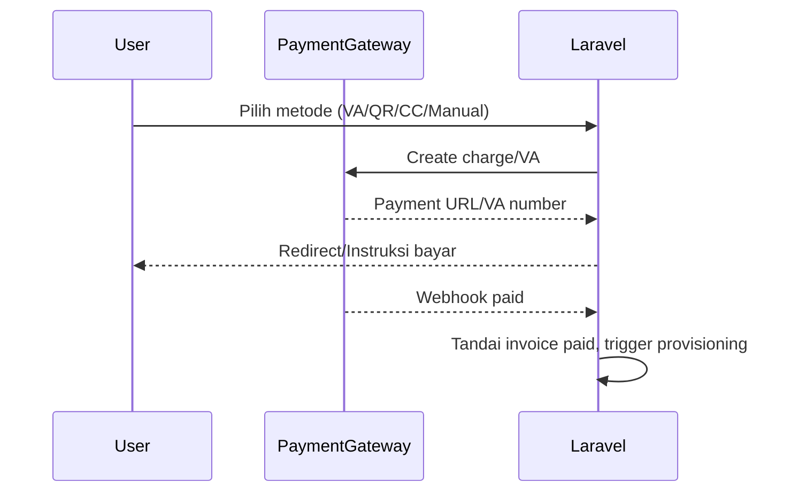
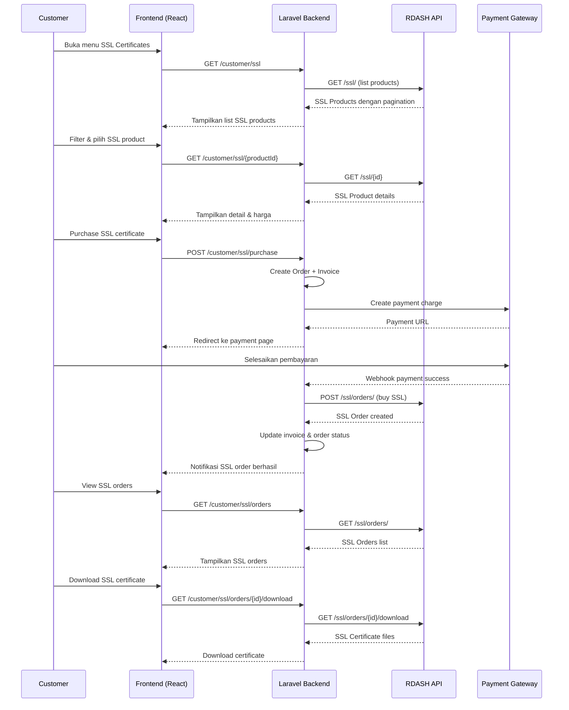
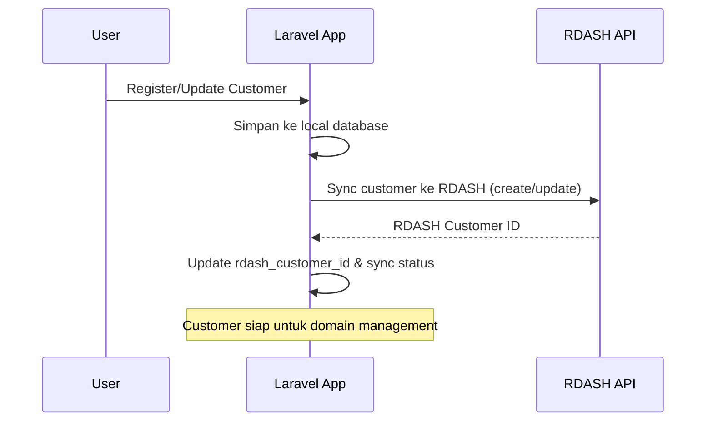
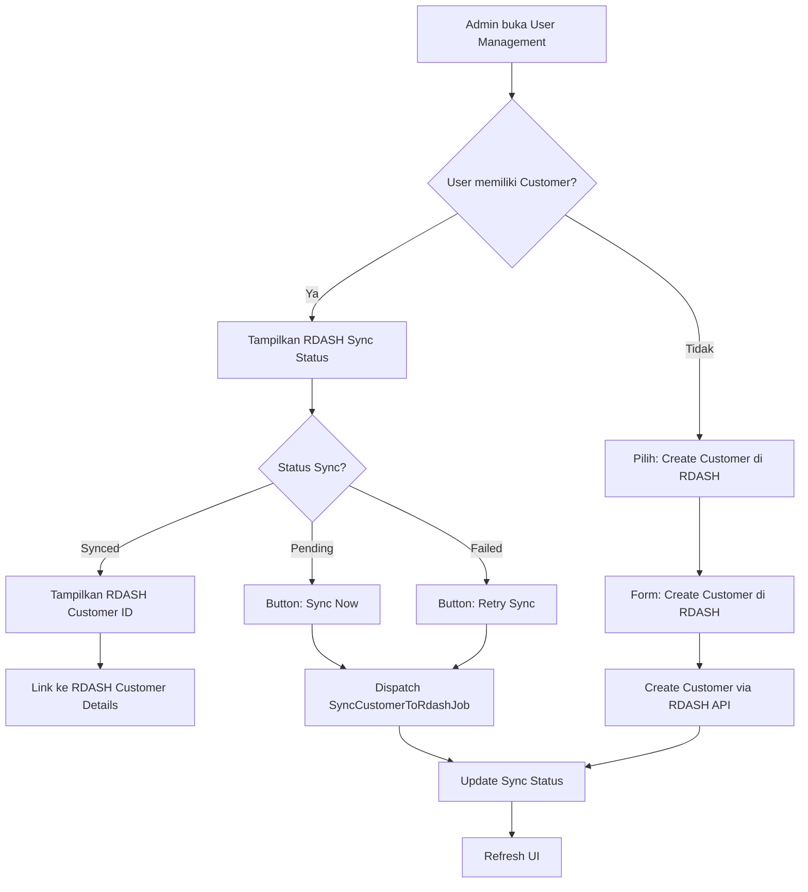

# plan.md — Aplikasi Penyewaan Hosting (Laravel + Inertia + React)

## Ringkasan

Aplikasi ini adalah platform penyewaan layanan hosting (shared/VPS) dengan dukungan manajemen paket, domain, order, langganan (subscription), penagihan (invoice), pembayaran otomatis/manual, provisioning ke panel (cPanel/DirectAdmin/Proxmox melalui adapter), dan dukungan tiket. Proyek menggunakan **Laravel + Inertia + React** (starterkit: `yogijowo/laravel12-react-starterkit`) dengan **Repository Pattern**, **Event-Driven**, **Job Queue**, dan **modular domain** agar mudah dikembangkan, scalable, dan terawat oleh tim.

**Integrasi RDASH API**: Aplikasi terintegrasi dengan RDASH API untuk domain management, customer management, DNS management, SSL management, dan layanan lainnya menggunakan pendekatan Domain-Driven Design.

---

## Tujuan Teknis

- **Scalable & Maintainable**: arsitektur domain-driven ringan + repository + service/use-case layer.
- **Extensible**: adapter provisioning (cPanel/DA/Proxmox) dapat ditambah tanpa mengubah domain logic.
- **Performant**: ULID sebagai PK, indeks tepat, caching, queue untuk proses lambat (provisioning, notifikasi).
- **Observability**: audit log, activity log, metrics (Horizon/Prometheus-bucket-ready).
- **RDASH Integration**: Integrasi seamless dengan RDASH API untuk domain dan customer management dengan sync otomatis/manual.

---

## Tumpukan Teknologi

- **Backend**: Laravel (PHP), Inertia, Horizon (queue), Spatie Permissions, Spatie Activity Log.
- **Frontend**: React (Vite), Tailwind, Headless UI/shadcn (opsional).
- **Database**: MySQL 8/14+ (InnoDB) atau PostgreSQL 14+. Gunakan read replica bila dibutuhkan.
- **Cache/Queue**: Redis (default).
- **CI/CD**: GitHub Actions, Envoy/Deployer.
- **Infra**: Docker Compose (dev), K8s/Swarm (prod) opsional, S3 kompatibel untuk bukti pembayaran/dokumen.
- **Payments**: Midtrans/Xendit/Tripay (via adapter).
- **Domain Management**: RDASH API (via Domain-Driven Design adapter).

> Catatan: versi spesifik mengikuti starterkit repo dan kebutuhan tim, namun rancangan tidak terikat vendor.

---

## Struktur Projek (direkomendasikan)

```
app/
  Domain/
    Billing/              # Invoice, Payment, Refund
    Catalog/              # Product, Plan, Addon
    Customer/             # Profile, Address, KYC (opsional)
    Order/                # Cart, Order, OrderItem
    Provisioning/         # Server, PanelAccount, ProvisionTask
    Subscription/         # Subscription, Cycle, Renewal
    Support/              # Ticket, Reply
    Rdash/                # RDASH API Integration (Domain-Driven Design)
      Account/            # Account management (profile, balance, prices, transactions)
      Customer/           # RDASH Customer management (sync dengan local customer)
      Contact/            # Contact management untuk customer RDASH
      Domain/             # Domain management via RDASH API
      Dns/                # DNS management
      Host/               # Child nameserver management
      Forwarding/         # Domain forwarding
      WhoisProtection/    # Whois protection
      Ssl/                # SSL certificate management
      ObjectStorage/      # Object storage management
      BareMetal/          # Bare metal server management
    Shared/               # ValueObjects, Contracts, Exceptions
  Application/            # UseCases/Services (orchestrator)
    Rdash/                # RDASH API use cases
  Infrastructure/
    Persistence/
      Eloquent/           # Eloquent implementations of Repositories
    Rdash/                # RDASH API Infrastructure
      HttpClient.php      # HTTP client untuk komunikasi dengan RDASH API
      Repositories/      # Implementasi repository untuk setiap domain RDASH
    Provisioning/
      Adapters/           # cPanelAdapter, DirectAdminAdapter, ProxmoxAdapter
    Payments/
      Adapters/           # MidtransAdapter, XenditAdapter, ManualTransferAdapter
    Mail/
resources/
  js/                     # React pages/components via Inertia
    pages/
      users/              # User management pages dengan RDASH integration
        Index.tsx         # List users dengan RDASH sync status
        Form.tsx          # Create/Edit user dengan RDASH customer form
        Show.tsx          # User details dengan tab RDASH integration
    components/
      rdash/              # RDASH integration components
        RdashSyncStatusBadge.tsx
        SyncToRdashButton.tsx
        RdashCustomerDetails.tsx
  views/
routes/
  web.php
  api.php
database/
  migrations/
  factories/
  seeders/
```

---

## Pola Repository (Ringkas)

- **Contracts** (interface) di `App/Domain/*/Contracts` misal: `ProductRepository`, `OrderRepository`, `SubscriptionRepository`.
- **Implementasi** di `App/Infrastructure/Persistence/Eloquent/*Repository` memakai Eloquent models.
- **Use Case / Service** di `App/Application/*` untuk orkestrasi bisnis (place order, pay invoice, provision account, renew subscription).
- **Controller** tipis: validasi -> panggil use case -> return Inertia response.
- **Event & Listener**: domain event (OrderPlaced, InvoicePaid, SubscriptionCreated, AccountProvisioned, TicketOpened, UserCreated, UserUpdated, CustomerCreated, CustomerUpdated).
- **Jobs**: `ProvisionAccountJob`, `ChargeGatewayJob`, `SendInvoiceEmailJob`, `RenewSubscriptionJob`.
- **RDASH Sync**: Sync customer ke RDASH dilakukan secara **synchronous** via `SyncUserToRdashService` untuk memastikan data tersinkronisasi segera tanpa delay queue.

Contoh kontrak (sketsa):

```php
namespace App\Domain\Order\Contracts;
interface OrderRepository {
  public function create(array $data): Order;
  public function findByUlid(string $id): ?Order;
  public function addItem(Order $order, array $itemData): void;
  public function markAsPaid(Order $order, string $paymentId): void;
}
```

Implementasi Eloquent mengikat ke model tetapi domain hanya bergantung ke kontrak.

---

## Alur Bisnis Utama

### 1) Registrasi & Onboarding



### 2) Pemilihan Paket & Order



### 3) Pembayaran



### 4) Provisioning Akun Hosting

```mermaid
flowchart LR
A[Invoice Paid] --> B[Dispatch ProvisionAccountJob]
B --> C{Adapter?}
C -->|cPanel| D[cPanelAdapter.createAccount()]
C -->|DirectAdmin| E[DAAdapter.createUser()]
C -->|Proxmox| F[ProxmoxAdapter.createVM()]
D --> G[Simpatkan credential terenkripsi]
E --> G
F --> G
G --> H[Update Subscription status=active]
H --> I[Email/Notifikasi Welcome]
```

### 5) Perpanjangan Otomatis

- `RenewSubscriptionJob` berjalan harian, cek subscription mendekati **due_at**.
- Jika auto-renew aktif → generate invoice baru → charge payment gateway → on paid → perpanjang di adapter.
- Jika gagal → notifikasi + masa tenggang (grace period) → suspend → terminate bila lewat batas.

### 6) Dukungan & Tiket

- User buka tiket → SLA dihitung → notifikasi ke agent → balasan via panel user → status (open, pending, solved, closed).

### 7) SSL Certificate Management



**Alur SSL Certificate Management:**

1. **List SSL Products:**

   - Customer membuka menu SSL Certificates (`/customer/ssl`)
   - System fetch SSL products dari RDASH API dengan pagination
   - Tampilkan list SSL products dengan filter (brand, type, wildcard)
   - Customer dapat melihat detail setiap product (features, harga, warranty)

2. **Purchase SSL Certificate:**

   - Customer pilih SSL product yang diinginkan
   - System create Order dan Invoice untuk SSL purchase
   - Integrasi dengan Payment Gateway (Midtrans/Xendit/Tripay)
   - Setelah payment success → System purchase SSL via RDASH API
   - SSL Order dibuat di RDASH dengan status sesuai proses validasi

3. **SSL Order Management:**

   - Customer dapat melihat semua SSL orders mereka
   - Status tracking: Pending, Validating, Active, Expired
   - Download SSL certificate setelah aktif
   - Manage SSL: Reissue, Revalidate, Cancel

4. **SSL Certificate Operations:**
   - **Reissue**: Generate ulang certificate dengan data baru
   - **Revalidate**: Re-validasi certificate yang sudah ada
   - **Download**: Download certificate files (certificate, private key, chain)
   - **Cancel**: Cancel SSL order jika masih dalam proses

**Menu SSL untuk Customer:**

- **Route**: `/customer/ssl`
- **Permission**: `customer-ssl-view` (required), `customer-ssl-create` (untuk purchase)
- **Icon**: `Shield`
- **Controller**: `App\Http\Controllers\Domain\Ssl\SslController`
- **Service**: `App\Application\Rdash\Ssl\ListSslProductsService`
- **Repository**: `App\Domain\Rdash\Ssl\Contracts\SslRepository`

**Menu SSL untuk Admin:**

- **Route**: `/admin/ssl`
- **Permission**: `admin-ssl-view`, `admin-ssl-manage`
- **Icon**: `Shield`
- **Fitur Tambahan**:
  - View semua SSL orders dari semua customers
  - Manage SSL orders (reissue, revalidate, cancel)
  - Monitor SSL certificate status
  - View SSL statistics dan reports

**Integrasi dengan Payment Gateway:**

- SSL purchase dapat menggunakan payment gateway yang sama dengan domain purchase
- Flow: Create Order → Generate Invoice → Payment Gateway → Webhook → Purchase SSL via RDASH API
- Service: `CheckoutSslService` (similar dengan `CheckoutDomainService`)

### 8) Integrasi Customer dengan RDASH API



**Alur Sync Customer:**

- Saat customer baru dibuat atau di-update → trigger sync ke RDASH API secara **synchronous** via `SyncUserToRdashService`
- Sync dilakukan langsung tanpa menggunakan queue untuk memastikan data tersinkronisasi segera
- Jika customer belum punya `rdash_customer_id` → create customer di RDASH
- Jika sudah ada → update customer di RDASH
- Simpan `rdash_customer_id` dan update `rdash_synced_at` setelah berhasil
- Jika gagal → set `rdash_sync_status` = `failed` dan log error
- Jika error "Email has already on this reseller" → otomatis mencari customer yang sudah ada dan link `rdash_customer_id`

**Contact Management:**

- Setiap customer dapat memiliki multiple contacts (Default, Admin, Technical, Billing, Registrant)
- Contacts digunakan untuk domain registration di RDASH
- Contacts di-sync ke RDASH saat diperlukan untuk domain operations

### 9) Integrasi User Management dengan RDASH API



**Alur User Management dengan RDASH:**

1. **Menu User Management** (`/users`):

   - Admin dapat melihat daftar semua user
   - Setiap user yang memiliki customer profile menampilkan:
     - RDASH Sync Status badge (Synced/Pending/Failed)
     - RDASH Customer ID (jika sudah synced)
     - Button "Sync to RDASH" atau "Retry Sync"
     - Link ke RDASH customer details (jika tersedia)

2. **Create/Edit User**:

   - Form user memiliki section tambahan untuk RDASH integration:
     - Checkbox "Create Customer in RDASH" (opsional)
     - Form fields untuk customer data (name, email, organization, address, phone)
     - Auto-sync setelah user dibuat/di-update jika checkbox dicentang

3. **Sync Operations**:

   - **Manual Sync**: Admin dapat trigger sync manual dari UI (synchronous)
   - **Auto Sync**: Otomatis sync saat user/customer dibuat atau di-update (synchronous via Event Listener)
   - **Bulk Sync**: Admin dapat sync multiple users sekaligus (synchronous)

4. **RDASH Customer Details**:
   - Di halaman detail user, tampilkan tab "RDASH Integration":
     - RDASH Customer Info (ID, status, last synced)
     - RDASH Contacts list
     - Button untuk manage contacts
     - Button untuk view domains di RDASH

**UI Components yang Diperlukan:**

- `UserIndex.tsx`: Tambahkan kolom RDASH Sync Status dan actions
- `UserForm.tsx`: Tambahkan section RDASH Customer Form
- `UserShow.tsx`: Tambahkan tab RDASH Integration
- `RdashSyncStatusBadge.tsx`: Component untuk menampilkan status sync
- `SyncToRdashButton.tsx`: Component untuk trigger sync
- `RdashCustomerDetails.tsx`: Component untuk menampilkan info customer RDASH

### 10) Menu Customer Area dengan SSL Management

**Struktur Menu Customer Area:**

Menu Customer Area (`/customer/*`) berisi sub-menu untuk mengelola berbagai layanan customer:

1. **My Orders** (`/customer/orders`)

   - Permission: `customer-orders-view`
   - Icon: `Package`
   - Fungsi: Lihat dan kelola semua order customer

2. **My Invoices** (`/customer/invoices`)

   - Permission: `customer-invoices-view`
   - Icon: `FileText`
   - Fungsi: Lihat dan download invoice

3. **My Subscriptions** (`/customer/subscriptions`)

   - Permission: `customer-subscriptions-view`
   - Icon: `CreditCard`
   - Fungsi: Kelola langganan hosting/VPS

4. **Support Tickets** (`/customer/tickets`)

   - Permission: `customer-tickets-view`
   - Icon: `MessageSquare`
   - Fungsi: Buat dan kelola tiket support

5. **My Domains** (`/customer/domains`)

   - Permission: `customer-domains-view`
   - Icon: `Globe`
   - Fungsi: Kelola domain (register, transfer, renew, manage DNS)

6. **SSL Certificates** (`/customer/ssl`)
   - Permission: `customer-ssl-view`
   - Icon: `Shield`
   - Fungsi: Lihat dan kelola SSL certificates
   - Fitur:
     - List SSL products dari RDASH API
     - Filter SSL products (brand, type, wildcard)
     - View SSL product details dan features
     - Purchase SSL certificate (integrasi dengan payment gateway)
     - View SSL orders dan status
     - Download SSL certificate
     - Manage SSL certificate (reissue, revalidate, cancel)

**Menu SSL untuk Customer:**

- Route: `/customer/ssl`
- Controller: `App\Http\Controllers\Domain\Ssl\SslController`
- Service: `App\Application\Rdash\Ssl\ListSslProductsService`
- Repository: `App\Domain\Rdash\Ssl\Contracts\SslRepository`
- Permission: `customer-ssl-view` (required), `customer-ssl-create` (untuk purchase)
- Integrasi: RDASH API untuk mendapatkan SSL products dan manage SSL orders

---

## Role & Perizinan

- **Customer**: kelola order, invoice, subscription, tiket, domain, SSL certificates.
- **Agent Support**: kelola tiket, baca profil pelanggan (sebagian).
- **Billing**: kelola invoice, refund, rekonsiliasi manual.
- **Admin**: semua, termasuk manajemen produk, server, adapter, kupon, user management dengan RDASH integration.
  > Gunakan **Spatie Permission**: roles (`admin`, `billing`, `support`, `customer`) + permissions granular untuk tiap use case.
  > Permission untuk RDASH: `rdash-sync`, `rdash-view`, `rdash-manage-contacts`.
  > Permission untuk SSL: `customer-ssl-view`, `customer-ssl-create`, `admin-ssl-view`, `admin-ssl-manage`.

---

## Desain Data & Skema Migrasi

> Gunakan **ULID** (`ulid()`/char(26)) sebagai PK. Setiap tabel memiliki `created_at`, `updated_at`, soft deletes bila relevan.
> Prefix domain untuk keterbacaan. Index semua kolom lookup & foreign key. Tipe uang: **bigInteger cents** atau **decimal(20,6)** (pilih satu konsisten).

### 1) Customers

- `customers`
  - `id` ULID PK
  - `user_id` FK -> users (opsional jika gabung users)
  - `name`, `email` (unique), `phone`, `tax_number` (opsional)
  - `billing_address_json` JSON
  - **RDASH Required Fields** (sesuai dengan requirement RDASH API):
    - `organization` string nullable (required untuk RDASH API)
    - `street_1` string nullable (required untuk RDASH API, default: 'Not Provided')
    - `street_2` string nullable (optional)
    - `city` string nullable (required untuk RDASH API, default: 'Jakarta')
    - `state` string nullable (optional)
    - `country_code` char(2) default 'ID' (required untuk RDASH API, ISO 3166-1 alpha-2)
    - `postal_code` string nullable (required untuk RDASH API, default: '00000')
    - `fax` string nullable (optional)
  - **RDASH Sync Fields**:
    - `rdash_customer_id` integer nullable (ID customer di RDASH untuk sync)
    - `rdash_synced_at` datetime nullable (waktu terakhir sync dengan RDASH)
    - `rdash_sync_status` enum: `pending|synced|failed` default `pending`
    - `rdash_sync_error` text nullable (error message jika sync gagal)
  - Index: `email`, `user_id`, `rdash_customer_id`, `rdash_sync_status`, `country_code`

> **Catatan RDASH API Requirements:**
>
> - RDASH API memerlukan field berikut sebagai **required**: `name`, `email`, `password`, `password_confirmation`, `organization`, `street_1`, `city`, `country_code`, `postal_code`, `voice` (min 9, max 20 karakter)
> - Field optional: `street_2`, `state`, `fax`
> - `country_code` harus sesuai ISO 3166-1 alpha-2 (contoh: ID, US, SG)
> - Saat sync ke RDASH, jika field required tidak ada, akan menggunakan default values untuk memastikan sync berhasil
>
> **Integrasi RDASH**: Customer lokal dapat di-sync dengan RDASH customer untuk domain management. Gunakan `RdashCustomerRepository` untuk CRUD customer di RDASH API. Service akan otomatis menggunakan default values untuk field required jika tidak ada data.
> **User Management Integration**: User yang memiliki customer profile dapat di-sync ke RDASH melalui menu User Management. Sync dapat dilakukan manual atau otomatis saat user/customer dibuat/di-update.

### 2) Catalog (Product & Plan)

- `products`

  - `id` ULID, `type` enum: `hosting_shared|vps|addon|domain`
  - `name`, `slug` unique, `status` enum: `active|draft|archived`
  - `metadata` JSON (fitur, limits, template adapter)
  - Index: `slug`, `type`, `status`

- `plans`

  - `id` ULID, `product_id` FK
  - `code` unique (misal BASIC-1Y), `billing_cycle` enum: `monthly|quarterly|semiannually|annually|biennially|triennially`
  - `price_cents` bigint, `currency` char(3)
  - `trial_days` int nullable, `setup_fee_cents` bigint default 0
  - Index: `product_id`, `code`

- `plan_features`
  - `id` ULID, `plan_id` FK, `key`, `value` (string/json)
  - Index: `plan_id`, `(plan_id,key)` unique

### 3) Promo

- `coupons`
  - `id` ULID, `code` unique, `type` enum: `percent|fixed`
  - `value` decimal(10,2), `max_uses` int, `used_count` int, `valid_from`, `valid_until`
  - `applicable_product_ids` JSON (array ULID) atau relasi tabel pivot
  - Index: `code`, `valid_until`

### 4) Cart & Order

- `carts`

  - `id` ULID, `customer_id` FK, `coupon_id` FK nullable, `currency`
  - `totals_json` JSON (subtotal, discount, tax, total)
  - Index: `customer_id`

- `cart_items`

  - `id` ULID, `cart_id` FK, `product_id` FK, `plan_id` FK nullable
  - `qty` int, `unit_price_cents` bigint, `meta` JSON (domain name, notes)
  - Index: `cart_id`

- `orders`

  - `id` ULID, `customer_id` FK, `status` enum: `pending|paid|cancelled|refunded|failed`
  - `currency`, `subtotal_cents`, `discount_cents`, `tax_cents`, `total_cents`
  - `coupon_id` FK nullable, `placed_at` datetime
  - Index: `customer_id`, `status`, `placed_at`

- `order_items`
  - `id` ULID, `order_id` FK, `product_id` FK, `plan_id` FK nullable, `subscription_id` FK nullable
  - `qty`, `unit_price_cents`, `total_cents`, `meta` JSON
  - Index: `order_id`

### 5) Billing (Invoice & Payment)

- `invoices`

  - `id` ULID, `order_id` FK nullable, `customer_id` FK
  - `number` string unique, `status` enum: `unpaid|paid|void|refunded|overdue|partial`
  - `currency`, `subtotal_cents`, `discount_cents`, `tax_cents`, `total_cents`, `due_at`
  - `notes` text nullable
  - Index: `customer_id`, `status`, `due_at`

- `invoice_items`

  - `id` ULID, `invoice_id` FK, `description`, `qty`, `unit_price_cents`, `total_cents`, `meta` JSON
  - Index: `invoice_id`

- `payments`

  - `id` ULID, `invoice_id` FK, `provider` enum, `provider_ref` string, `amount_cents` bigint
  - `status` enum: `pending|succeeded|failed`, `paid_at` datetime nullable, `raw_payload` JSON
  - Index: `invoice_id`, `provider`, `status`

- `refunds`
  - `id` ULID, `payment_id` FK, `amount_cents`, `reason`, `status` enum: `pending|succeeded|failed`, `raw_payload` JSON
  - Index: `payment_id`, `status`

### 6) Subscription

- `subscriptions`

  - `id` ULID, `customer_id` FK, `product_id` FK, `plan_id` FK
  - `status` enum: `trialing|active|past_due|suspended|cancelled|terminated`
  - `start_at`, `end_at` nullable, `next_renewal_at`, `auto_renew` bool, `provisioning_status` enum: `pending|in_progress|done|failed`
  - `meta` JSON (credential secret ref, panel username, domain, limits)
  - Index: `customer_id`, `status`, `next_renewal_at`

- `subscription_cycles`
  - `id` ULID, `subscription_id` FK, `cycle_no` int, `period_start`, `period_end`, `invoice_id` FK nullable, `payment_id` FK nullable
  - Index: `subscription_id`, `period_end`

### 7) Provisioning

- `servers`

  - `id` ULID, `name`, `type` enum: `cpanel|directadmin|proxmox`, `endpoint`, `auth_secret_ref`, `status` enum: `active|maintenance|disabled`
  - `meta` JSON (limit account, packages mapping)
  - Index: `type`, `status`

- `panel_accounts`

  - `id` ULID, `server_id` FK, `subscription_id` FK, `username`, `domain`, `status` enum: `active|suspended|terminated`
  - `last_sync_at` datetime nullable, `meta` JSON
  - Unique: `(server_id, username)`

- `provision_tasks`
  - `id` ULID, `subscription_id` FK, `server_id` FK, `action` enum: `create|suspend|unsuspend|terminate|change_plan|reset_password|sync`
  - `status` enum: `queued|running|succeeded|failed`, `attempts` int, `error` text nullable
  - Index: `status`, `action`, `subscription_id`

### 8) Domain

- `domains`
  - `id` ULID, `customer_id` FK, `name` unique, `status` enum: `active|pending|expired`
  - `whois_json` JSON, `auto_renew` bool
  - **RDASH Integration Fields**:
    - `rdash_domain_id` integer nullable (ID domain di RDASH untuk sync)
    - `rdash_synced_at` datetime nullable
    - `rdash_sync_status` enum: `pending|synced|failed` default `pending`
    - `rdash_verification_status` integer nullable (0. Waiting, 1. Verifying, 2. Document Validating, 3. Active)
    - `rdash_required_document` boolean default false
  - Index: `customer_id`, `status`, `rdash_domain_id`, `rdash_sync_status`

> **Integrasi RDASH**: Domain dapat di-register, transfer, renew, dan manage melalui RDASH API. Gunakan `RdashDomainRepository` untuk operasi domain di RDASH. Sync status digunakan untuk tracking sync antara local database dengan RDASH.
>
> **RDASH Domain Status**:
>
> - Status: `0` Pending, `1` Active, `2` Expired, `3` Pending Delete, `4` Deleted, `5` Pending Transfer, `6` Transferred Away, `7` Suspended, `8` Rejected
> - Verification Status: `0` Waiting, `1` Verifying, `2` Document Validating, `3` Active
> - Required Document: `0` False, `1` True
>
> **Pembayaran Domain via Midtrans Core API**:
>
> - Domain dapat dibeli dengan pembayaran melalui Midtrans Core API (`/v2/charge`)
> - Flow: User pilih domain → Check availability → Get price dari RDASH → Pilih payment method → Checkout → Create Order & Invoice → Create Payment via Midtrans Core API → Redirect sesuai payment method (3DS untuk credit card, atau tampilkan VA/QR code) → Setelah payment success → Register domain ke RDASH secara otomatis
> - Service `CheckoutDomainService` menangani proses checkout domain dengan payment
> - Listener `RegisterDomainOnInvoicePaid` akan otomatis register domain ke RDASH setelah invoice paid
> - Domain dibuat dengan status `pending` terlebih dahulu, baru di-register ke RDASH setelah payment berhasil
> - Payment method yang dipilih user menentukan parameter yang dikirim ke Core API:
>   - Credit Card: `payment_type: credit_card` → redirect ke 3DS jika diperlukan
>   - Bank Transfer: `payment_type: bank_transfer` dengan `bank` spesifik → tampilkan VA number
>   - E-Wallet: `payment_type: gopay/shopeepay/dana/ovo/linkaja` → tampilkan deeplink atau QR code
>   - QRIS: `payment_type: qris` → tampilkan QR code
>   - Convenience Store: `payment_type: cstore` dengan `store` spesifik → tampilkan payment code

### 9) Support

- `tickets`

  - `id` ULID, `customer_id` FK, `subject`, `status` enum: `open|pending|solved|closed`, `priority` enum: `low|normal|high|urgent`
  - `sla_due_at` datetime nullable
  - Index: `customer_id`, `status`, `priority`

- `ticket_replies`
  - `id` ULID, `ticket_id` FK, `user_id` FK nullable (agent) / `customer_id` FK nullable
  - `message` text, `attachments` JSON
  - Index: `ticket_id`

### 12) SSL Products

- `ssl_products`
  - `id` ULID PK
  - `rdash_ssl_product_id` integer unique (ID dari RDASH API)
  - `provider` string (gogetssl)
  - `brand` string (Comodo, Geotrust, Digicert)
  - `name` string (Sectigo PositiveSSL, RapidSSL, dll)
  - `ssl_type` enum: `DV|OV|EV` (Domain Validation, Organization Validation, Extended Validation)
  - `is_wildcard` boolean
  - `is_refundable` boolean
  - `max_period` integer (maksimal periode dalam tahun)
  - `status` tinyint (0 = inactive, 1 = active)
  - `features` JSON (domain, issuance, warranty, site_seal, validation, description, authentication_level, subdomain)
  - `price_cents` bigint nullable (harga dalam cents jika ada)
  - `currency` char(3) default 'IDR'
  - `rdash_synced_at` datetime nullable
  - Index: `rdash_ssl_product_id`, `provider`, `brand`, `ssl_type`, `status`, `(is_wildcard, ssl_type)`

> **Integrasi RDASH**: SSL products dapat di-list, filter, dan manage melalui RDASH API. Gunakan `SslRepository` untuk operasi SSL di RDASH. Tabel `ssl_products` digunakan untuk cache lokal produk SSL dari RDASH API.

### 13) Audit & Config

- `activity_log` (Spatie) untuk audit trail.
- `settings`
  - `id` ULID, `key` unique, `value` JSON (branding, tax rate, payment configs, smtp, feature flags).
- `webhooks`
  - `id` ULID, `name`, `url`, `secret`, `events` JSON, `active` bool.

---

## Indeks, Constraint, & Skala

- Foreign keys **ON DELETE RESTRICT/SET NULL** sesuai konteks (hindari cascade pada data kritis billing).
- Indeks gabungan untuk query umum:
  - `subscriptions (customer_id, status, next_renewal_at)`,
  - `invoices (customer_id, status, due_at)`,
  - `provision_tasks (status, action)`,
  - `customers (rdash_sync_status, rdash_customer_id)`,
  - `ssl_products (is_wildcard, ssl_type)`.
- Partisi (opsional, PostgreSQL) untuk `activity_log`/`payments` jika volume besar.
- Pisahkan **read model** (caching: Redis) untuk dashboard/metrik.
- Gunakan **ulids()** helper pada migration untuk konsistensi.

---

## Integrasi & Adapter

- **ProvisioningAdapterInterface**
  - `createAccount(Subscription $sub, array $params): PanelAccount`
  - `suspendAccount(PanelAccount $acc): void`
  - `terminateAccount(PanelAccount $acc): void`
  - `changePlan(PanelAccount $acc, Plan $plan): void`
- **PaymentAdapterInterface**
  - `createCharge(Invoice $invoice, array $options): Payment`
  - `handleWebhook(array $payload): Payment|void`
- **RDASH API Adapters** (Domain-Driven Design)
  - `AccountRepository` - Account management (profile, balance, prices, transactions)
  - `RdashCustomerRepository` - Customer CRUD di RDASH API
  - `ContactRepository` - Contact management untuk customer
  - `RdashDomainRepository` - Domain operations (list dengan filter, register, transfer, renew, manage, check availability, get details)
    - `getAll(array $filters)` - List domains dengan filter (customer_id, name, status, verification_status, required_document, created_range, expired_range, orderBy, page, limit)
    - `getById(int $domainId)` - Get domain by ID
    - `getByName(string $domainName)` - Get domain details by domain name (GET `/domains/details`)
    - `checkAvailability(string $domain, bool $includePremium)` - Check domain availability (GET `/domains/availability`)
    - `register(array $data)` - Register new domain (POST `/domains`)
    - `transfer(array $data)` - Transfer domain
    - `renew(int $domainId, array $data)` - Renew domain
    - `updateNameservers(int $domainId, array $nameservers)` - Update nameservers
    - `lock(int $domainId)` / `unlock(int $domainId)` - Lock/unlock domain
    - `suspend(int $domainId)` / `unsuspend(int $domainId)` - Suspend/unsuspend domain
  - `DnsRepository` - DNS records management
  - `HostRepository` - Child nameserver management
  - `ForwardingRepository` - Domain forwarding
  - `WhoisProtectionRepository` - Whois protection
  - `SslRepository` - SSL certificate management
    - `getProducts(array $filters)` - List SSL products dengan filter (name, provider, brand, ssl_type, is_wildcard, status, page, limit)
    - `getProductsWithPrices(array $filters)` - Get SSL products dengan prices
    - `getProductsWithPagination(array $filters)` - List SSL products dengan pagination info (links & meta)
    - `getOrders(array $filters)` - List SSL orders
    - `getOrderById(int $sslOrderId)` - Get SSL order by ID
    - `generateCsr(array $data)` - Generate CSR
    - `buy(array $data)` - Buy SSL certificate
    - `changeValidationMethod(int $sslOrderId, array $data)` - Change validation method
    - `revalidate(int $sslOrderId)` - Revalidate SSL
    - `reissue(int $sslOrderId, array $data)` - Reissue SSL
    - `download(int $sslOrderId)` - Download SSL certificate
    - `cancel(int $sslOrderId)` - Cancel SSL order
  - `ObjectStorageRepository` - Object storage management
  - `BareMetalRepository` - Bare metal server management

Setiap adapter di-_bind_ lewat Service Provider berdasarkan konfigurasi. RDASH API menggunakan HTTP client dengan retry mechanism dan error handling.

---

## Rute Utama (Inertia + React)

- **Guest**: `/`, `/catalog`, `/plans/{product}`, `/register`, `/login`.
- **Customer**:
  - `/dashboard` - Dashboard customer
  - `/customer/orders` - My Orders (lihat dan kelola order)
  - `/customer/invoices` - My Invoices (lihat dan download invoice)
  - `/customer/subscriptions` - My Subscriptions (kelola langganan)
  - `/customer/tickets` - Support Tickets (buat dan kelola tiket support)
  - `/customer/domains` - My Domains (kelola domain)
  - `/customer/ssl` - SSL Certificates (lihat dan kelola SSL certificates)
- **Admin**: `/admin/products`, `/admin/plans`, `/admin/orders`, `/admin/invoices`, `/admin/subscriptions`, `/admin/servers`, `/admin/settings`, `/admin/tickets`, `/admin/customers`, `/admin/domains`, `/admin/ssl`, `/users` (dengan integrasi RDASH).

### RDASH API Routes (REST API)

- **Account**: `/api/rdash/account/profile`, `/api/rdash/account/balance`, `/api/rdash/account/prices`, `/api/rdash/account/transactions`
- **Customer**: `/api/rdash/customers` (CRUD), `/api/rdash/customers/{id}/contacts` (Contact management)
- **Domain**: `/api/rdash/domains` (CRUD), `/api/rdash/domains/availability`, `/api/rdash/domains/register`, `/api/rdash/domains/transfer`, `/api/rdash/domains/{id}/renew`
- **DNS**: `/api/rdash/domains/{id}/dns` (DNS records management)
- **SSL**:
  - `GET /api/rdash/ssl/products` - List SSL products dengan pagination (filters: name, provider, brand, ssl_type, is_wildcard, status, page, limit)
  - `GET /api/rdash/ssl/products/prices` - List SSL products dengan prices
  - `GET /api/rdash/ssl/orders` - List SSL orders
  - `GET /api/rdash/ssl/orders/{sslOrderId}` - Get SSL order by ID

**RDASH API Response Structure:**

Semua endpoint RDASH API mengembalikan response dengan struktur:

```json
{
	"success": true,
	"data": {
		// Response data sesuai endpoint
	},
	"message": "Success"
}
```

Untuk endpoint `GET /customers/{customer_id}`, struktur `data` adalah:

```json
{
	"id": 259071,
	"name": "YUDO JUNI HARDIKO",
	"email": "yudojuni93@gmail.com",
	"organization": "abah web",
	"street_1": "nganjuk",
	"street_2": null,
	"city": "nganjuk",
	"state": "Indonesia",
	"country": "Indonesia",
	"country_code": "ID",
	"postal_code": "64183",
	"voice": "08994750136",
	"fax": null,
	"reg_id": null,
	"is_2fa_enabled": false,
	"created_at": "2025-11-19T11:13:56.000000Z",
	"updated_at": "2025-11-19T11:13:56.000000Z"
}
```

Untuk endpoint `GET /domains/availability`, struktur response adalah:

```json
{
	"success": true,
	"data": [
		{
			"name": "abahweb.id",
			"available": 1,
			"message": "available"
		}
	],
	"message": "Success"
}
```

Untuk endpoint `GET /domains`, struktur response dengan pagination:

```json
{
	"success": true,
	"data": [
		{
			"id": 123,
			"name": "example.com",
			"customer_id": 259071,
			"status": 1,
			"verification_status": 3,
			"required_document": 0,
			"expired_at": "2026-11-19T00:00:00.000000Z",
			"created_at": "2025-11-19T00:00:00.000000Z",
			"nameservers": ["ns1.example.com", "ns2.example.com"]
		}
	],
	"message": "Success"
}
```

Untuk endpoint `POST /domains` (Register), struktur request:

```json
{
	"name": "example.com",
	"period": 1,
	"customer_id": 259071,
	"nameserver[0]": "ns1.example.com",
	"nameserver[1]": "ns2.example.com",
	"buy_whois_protection": false,
	"include_premium_domains": false,
	"registrant_contact_id": null
}
```

**Domain Status Values:**

- `0` - Pending
- `1` - Active
- `2` - Expired
- `3` - Pending Delete
- `4` - Deleted
- `5` - Pending Transfer
- `6` - Transferred Away
- `7` - Suspended
- `8` - Rejected

**Verification Status Values:**

- `0` - Waiting
- `1` - Verifying
- `2` - Document Validating
- `3` - Active

Untuk endpoint `GET /ssl/`, struktur response dengan pagination:

```json
{
	"data": [
		{
			"id": 1,
			"provider": "gogetssl",
			"brand": "Comodo",
			"name": "Sectigo PositiveSSL",
			"ssl_type": "DV",
			"is_wildcard": 0,
			"is_refundable": 1,
			"max_period": 3,
			"status": 1,
			"features": {
				"domain": "Single Domain",
				"issuance": "Instant Publish",
				"warranty": "$50.000 warranty",
				"site_seal": "Static Site Seal",
				"validation": "Domain Validation (DV)",
				"description": "For Personal Website",
				"authentication_level": "Tingkat Autentikasi 2"
			},
			"created_at": "2024-10-14T04:19:39.000000Z",
			"updated_at": "2024-10-14T04:19:39.000000Z"
		}
	],
	"links": {
		"first": "https://api.rdash.id/v1/ssl?limit=10&status=1&page=1",
		"last": "https://api.rdash.id/v1/ssl?limit=10&status=1&page=2",
		"prev": null,
		"next": "https://api.rdash.id/v1/ssl?limit=10&status=1&page=2"
	},
	"meta": {
		"current_page": 1,
		"from": 1,
		"last_page": 2,
		"path": "https://api.rdash.id/v1/ssl",
		"per_page": 10,
		"to": 10,
		"total": 14
	}
}
```

**SSL Product Fields:**

- `id` - ID produk SSL dari RDASH
- `provider` - Provider SSL (gogetssl)
- `brand` - Brand SSL (Comodo, Geotrust, Digicert)
- `name` - Nama produk SSL
- `ssl_type` - Tipe SSL: `DV` (Domain Validation), `OV` (Organization Validation), `EV` (Extended Validation)
- `is_wildcard` - `0` atau `1` (apakah wildcard SSL)
- `is_refundable` - `0` atau `1` (apakah bisa di-refund)
- `max_period` - Maksimal periode dalam tahun
- `status` - `0` (inactive) atau `1` (active)
- `features` - JSON object berisi fitur SSL (domain, issuance, warranty, site_seal, validation, description, authentication_level, subdomain)

### User Management Routes dengan RDASH Integration

- **User Management**:
  - `GET /users` - List users dengan RDASH sync status
  - `GET /users/create` - Form create user dengan option create RDASH customer
  - `POST /users` - Create user (dengan optional RDASH sync)
  - `GET /users/{id}` - Show user dengan tab RDASH integration
  - `GET /users/{id}/edit` - Edit user dengan RDASH customer form
  - `PUT /users/{id}` - Update user (dengan optional RDASH sync)
  - `POST /users/{id}/sync-rdash` - Manual sync user ke RDASH
  - `POST /users/bulk-sync-rdash` - Bulk sync multiple users ke RDASH
  - `GET /users/{id}/rdash-customer` - Get RDASH customer details
  - `PUT /users/{id}/rdash-customer` - Update RDASH customer (menggunakan PUT `/customers/{customer_id}` di RDASH API)
  - `GET /users/{id}/rdash-contacts` - Get RDASH contacts untuk user
  - `POST /users/{id}/rdash-contacts` - Create contact di RDASH untuk user

Komponen React dipetakan ke halaman Inertia. Pakai form helpers + zod/yup untuk validasi di FE; validasi akhir tetap di Laravel FormRequest.

---

## Use Case Utama (Application Layer)

- `PlaceOrderService`
- `ApplyCouponService`
- `GenerateInvoiceService`
- `PayInvoiceService` (via PaymentAdapter)
- `ProvisionAccountService` (dispatch Job)
- `RenewSubscriptionService`
- `SuspendSubscriptionService`, `TerminateSubscriptionService`
- `OpenTicketService`, `ReplyTicketService`

### RDASH API Use Cases

- `SyncCustomerToRdashService` - Sync customer lokal ke RDASH API
- `CreateRdashCustomerService` - Buat customer baru di RDASH
- `UpdateRdashCustomerService` - Update customer di RDASH
- `CreateRdashContactService` - Buat contact untuk customer di RDASH
- `RegisterDomainViaRdashService` - Register domain melalui RDASH API (POST `/domains`)
  - Required: name, period (years), customer_id
  - Optional: nameservers[0-4], buy_whois_protection, include_premium_domains, registrant_contact_id
- `TransferDomainViaRdashService` - Transfer domain melalui RDASH API
- `RenewDomainViaRdashService` - Renew domain melalui RDASH API
- `CheckDomainAvailabilityService` - Cek ketersediaan domain via RDASH (GET `/domains/availability`)
  - Parameters: domain (required), include_premium_domains (optional)
  - Response: {success: true, data: [{name, available, message}], message: "Success"}
- `GetDomainDetailsService` - Get domain details by domain name (GET `/domains/details`)
  - Parameter: domain_name (required)
  - Returns domain details atau null jika tidak ditemukan (404)
- `ListDomainsViaRdashService` - List all domains dengan filter (GET `/domains`)
  - Supports filtering: customer_id, name, status, verification_status, required_document, created_range, expired_range
  - Supports ordering: f_params[orderBy][field], f_params[orderBy][type]
  - Supports pagination: page, limit
- `ManageDnsViaRdashService` - Kelola DNS records melalui RDASH
- `ListSslProductsService` - List SSL products dari RDASH API dengan pagination
  - Supports filtering: name, provider, brand, ssl_type, is_wildcard, status
  - Supports pagination: page, limit
  - Returns: products array, links (pagination), meta (pagination info)
- `ManageSslViaRdashService` - Kelola SSL certificate melalui RDASH (buy, reissue, download, cancel)

### Domain Purchase dengan Payment Use Cases

- `CheckoutDomainService` - Checkout domain dengan payment gateway (Midtrans Core API)
  - Get domain price dari RDASH API berdasarkan extension
  - Create Order dengan item domain
  - Generate Invoice untuk domain purchase
  - Create Domain record dengan status `pending` (belum register ke RDASH)
  - Create Payment via Midtrans Core API adapter dengan payment method yang dipilih user
  - Return invoice dan payment untuk redirect atau tampilkan payment details (VA/QR code/payment code)
- `RegisterDomainOnInvoicePaid` (Listener) - Register domain ke RDASH setelah invoice paid
  - Triggered oleh event `InvoicePaid`
  - Cek apakah invoice untuk domain purchase (via invoice item meta)
  - Register domain ke RDASH menggunakan data dari invoice item meta
  - Update domain status dan RDASH sync status setelah berhasil register

### SSL Certificate Purchase dengan Payment Use Cases

- `CheckoutSslService` - Checkout SSL certificate dengan payment gateway
  - Get SSL product details dari RDASH API berdasarkan product ID
  - Create Order dengan item SSL certificate
  - Generate Invoice untuk SSL purchase
  - Create SSL Order record dengan status `pending` (belum purchase ke RDASH)
  - Create Payment via payment adapter (Midtrans/Xendit/Tripay)
  - Return invoice dan payment untuk redirect ke payment page
- `PurchaseSslOnInvoicePaid` (Listener) - Purchase SSL certificate ke RDASH setelah invoice paid
  - Triggered oleh event `InvoicePaid`
  - Cek apakah invoice untuk SSL purchase (via invoice item meta)
  - Purchase SSL ke RDASH menggunakan data dari invoice item meta (domain, CSR, validation method)
  - Update SSL order status dan RDASH sync status setelah berhasil purchase

### User Management Use Cases dengan RDASH

- `SyncUserToRdashService` - Sync user ke RDASH customer (cek apakah user punya customer, jika belum create customer, lalu sync)
- `CreateUserWithRdashCustomerService` - Create user sekaligus create customer di RDASH
- `UpdateUserWithRdashSyncService` - Update user dan sync ke RDASH jika diperlukan
- `BulkSyncUsersToRdashService` - Sync multiple users ke RDASH dalam batch
- `GetRdashCustomerForUserService` - Get RDASH customer details untuk user
- `UpdateRdashCustomerService` - Update customer RDASH via PUT `/customers/{customer_id}` endpoint
- `ManageRdashContactsForUserService` - Manage contacts di RDASH untuk user
- `RetryFailedRdashSyncService` - Retry sync yang gagal untuk user tertentu

---

## Kebijakan Bisnis

- **Grace Period** default 7 hari pasca jatuh tempo → suspend otomatis.
- **Tax & Fees** per negara/region disimpan di `settings`.
- **Refund** mengikuti statusPayment & gateway capability.
- **Coupon** validasi tanggal, limit pemakaian, cakupan produk/plan.
- **RDASH Sync**: Sync otomatis saat customer dibuat/di-update dilakukan secara **synchronous** untuk memastikan data tersinkronisasi segera. Manual sync tersedia di UI. Jika sync gagal, status akan di-set ke `failed` dan dapat di-retry manual.

---

## Migrasi (Contoh Potongan)

```php
// database/migrations/2025_01_01_000000_create_products_table.php
Schema::create('products', function (Blueprint $table) {
    $table->ulid('id')->primary();
    $table->enum('type', ['hosting_shared','vps','addon','domain']);
    $table->string('name');
    $table->string('slug')->unique();
    $table->enum('status', ['active','draft','archived'])->default('draft');
    $table->json('metadata')->nullable();
    $table->timestamps();
});
```

```php
// database/migrations/2025_01_01_000100_create_plans_table.php
Schema::create('plans', function (Blueprint $table) {
    $table->ulid('id')->primary();
    $table->foreignUlid('product_id')->constrained('products');
    $table->string('code')->unique();
    $table->enum('billing_cycle', ['monthly','quarterly','semiannually','annually','biennially','triennially']);
    $table->unsignedBigInteger('price_cents');
    $table->char('currency', 3)->default('IDR');
    $table->unsignedInteger('trial_days')->nullable();
    $table->unsignedBigInteger('setup_fee_cents')->default(0);
    $table->timestamps();
});
```

```php
// database/migrations/2025_01_01_000200_add_rdash_sync_to_customers_table.php
Schema::table('customers', function (Blueprint $table) {
    $table->unsignedInteger('rdash_customer_id')->nullable()->after('billing_address_json');
    $table->timestamp('rdash_synced_at')->nullable()->after('rdash_customer_id');
    $table->enum('rdash_sync_status', ['pending', 'synced', 'failed'])->default('pending')->after('rdash_synced_at');
    $table->text('rdash_sync_error')->nullable()->after('rdash_sync_status');

    $table->index('rdash_customer_id');
    $table->index('rdash_sync_status');
});
```

```php
// database/migrations/2025_11_23_143448_create_ssl_products_table.php
Schema::create('ssl_products', function (Blueprint $table) {
    $table->ulid('id')->primary();
    $table->unsignedInteger('rdash_ssl_product_id')->unique();
    $table->string('provider');
    $table->string('brand');
    $table->string('name');
    $table->enum('ssl_type', ['DV', 'OV', 'EV'])->default('DV');
    $table->boolean('is_wildcard')->default(false);
    $table->boolean('is_refundable')->default(true);
    $table->unsignedInteger('max_period')->default(1);
    $table->unsignedTinyInteger('status')->default(1);
    $table->json('features')->nullable();
    $table->unsignedBigInteger('price_cents')->nullable();
    $table->char('currency', 3)->default('IDR');
    $table->timestamp('rdash_synced_at')->nullable();
    $table->timestamps();
    $table->softDeletes();

    $table->index('rdash_ssl_product_id');
    $table->index('provider');
    $table->index('brand');
    $table->index('ssl_type');
    $table->index('status');
    $table->index(['is_wildcard', 'ssl_type']);
});
```

> Lanjutkan pola serupa untuk tabel lain; gunakan `foreignUlid`, indeks gabungan, dan `softDeletes()` sesuai kebutuhan.

---

## Seeders & Factory

- Factory untuk `Product`, `Plan`, `Server`, `Customer`, `Subscription`, `Ticket`.
- Seeder membuat **paket contoh**, **server cPanel demo**, **admin user**, **kupon demo**, **10 pelanggan** untuk uji alur penuh.

---

## Keamanan & Kepatuhan

- Simpan kredensial panel/gateway via **Secret Manager**/ENV + `auth_secret_ref` (jangan plain text).
- Enkripsi data sensitif (misal credential account) dengan `Crypt::encryptString` + key rotate policy.
- Rate limiting untuk auth, webhook, dan ticket upload.
- Webhook signature verification untuk gateway & adapter eksternal.
- RDASH API credentials disimpan di ENV, tidak di database.

---

## Observability

- Log aktivitas (Spatie), log domain event, job metrics (Horizon).
- Health check endpoint `/health` untuk liveness/readiness.
- Structured logging (JSON) untuk prod dan sentry/bugsnag integrasi.
- Logging khusus untuk RDASH API calls (request/response, errors, sync status).

---

## Roadmap Fitur

1. v1: Catalog, Order, Invoice, Pembayaran manual & 1 gateway, Provisioning cPanel, Subscriptions, Tickets.
2. v1.1: Domain management dasar, Auto-renew, Reminder email.
3. v1.2: Multi-gateway & refund, DirectAdmin adapter, Report penjualan.
4. v1.3: **Integrasi RDASH API** - Customer sync, Domain management via RDASH, DNS management, SSL management, **User Management dengan RDASH Integration**.
5. v2: VPS/Proxmox adapter, Reseller mode, API publik untuk reseller, Object Storage & Bare Metal via RDASH.

---

## Quality & Workflow Tim

- **Branching**: trunk-based/feature branch + PR + code review.
- **Test**: PHPUnit + Pest; tulis test untuk Use Case & Repository (mock kontrak).
- **Static Analysis**: Larastan, PHP-CS-Fixer.
- **Docs**: ADR (Architecture Decision Record) per perubahan arsitektur.

---

## Catatan Integrasi Starterkit

- Gunakan auth, layout, pipeline Inertia dari starterkit `yogijowo/laravel12-react-starterkit`.
- Tambahkan ServiceProvider per-bounded-context untuk binding repository & adapter:
  - `CatalogServiceProvider`, `OrderServiceProvider`, `BillingServiceProvider`, `ProvisioningServiceProvider`, `SubscriptionServiceProvider`, `SupportServiceProvider`, `RdashServiceProvider`.
- Tambahkan middleware `\App\Http\Middleware\Impersonate` (opsional) untuk dukung bantuan agent.

### Konfigurasi RDASH API

Tambahkan ke `.env`:

```env
RDASH_API_URL=https://api.rdash.id/v1
RDASH_RESELLER_ID=your_reseller_id
RDASH_API_KEY=your_api_key
RDASH_TIMEOUT=30
RDASH_RETRY_TIMES=3
RDASH_RETRY_DELAY=100
```

**Arsitektur RDASH Integration:**

- Menggunakan **Domain-Driven Design** dengan pemisahan layer yang jelas
- **Domain Layer**: Contracts (interfaces) dan Value Objects untuk setiap domain
- **Infrastructure Layer**: HTTP Client dan Repository implementations
- **Application Layer**: Use Cases/Services untuk business logic orchestration
- **Presentation Layer**: API Controllers dengan validasi

### Konfigurasi Payment Gateway (Midtrans)

Tambahkan ke `.env`:

```env
PAYMENT_DEFAULT=midtrans
MIDTRANS_SERVER_KEY=your_midtrans_server_key
MIDTRANS_CLIENT_KEY=your_midtrans_client_key
MIDTRANS_IS_PRODUCTION=false
```

**Catatan**:

- Untuk development/testing, gunakan `MIDTRANS_IS_PRODUCTION=false` (sandbox mode)
- Untuk production, set `MIDTRANS_IS_PRODUCTION=true` dan gunakan production server key
- Midtrans webhook URL: `https://your-domain.com/api/payments/midtrans/webhook`

**Integrasi Midtrans Core API**:

- Aplikasi menggunakan **Midtrans Core API** (`/v2/charge`) untuk pembayaran langsung tanpa Snap.js
- Core API memberikan kontrol lebih besar terhadap payment flow dan response handling
- Metode pembayaran yang didukung:
  - **Credit Card**: Visa, Mastercard, JCB, Amex (dengan 3DS jika diperlukan)
  - **Bank Transfer**: BCA VA, BNI VA, BRI VA, Mandiri VA, Permata VA, CIMB VA, Danamon VA, BSI VA
  - **E-Wallet**: GoPay, ShopeePay, DANA, OVO, LinkAja
  - **QRIS**: QRIS untuk berbagai e-wallet
  - **Convenience Store**: Indomaret, Alfamart
- Response Core API berbeda berdasarkan payment method:
  - Credit Card: `redirect_url` untuk 3DS authentication
  - Bank Transfer: `va_numbers` array dengan bank dan VA number
  - E-Wallet: `actions` dengan deeplink atau QR code
  - QRIS: `actions` dengan QR code URL
  - Convenience Store: `actions` dengan payment code
- Payment details (VA number, QR code, payment code) disimpan di `raw_payload` untuk ditampilkan ke user

**Keuntungan Pendekatan DDD untuk RDASH:**

- Separation of Concerns: setiap layer memiliki tanggung jawab jelas
- Testability: mudah mock repository untuk testing
- Maintainability: perubahan di satu layer tidak mempengaruhi layer lain
- Extensibility: mudah menambah fitur baru tanpa mengubah kode yang ada
- Type Safety: Value Objects memastikan data konsisten dan valid

---

## Contoh Binding Repository

```php
// app/Providers/BillingServiceProvider.php
public function register()
{
    $this->app->bind(
        \App\Domain\Billing\Contracts\InvoiceRepository::class,
        \App\Infrastructure\Persistence\Eloquent\InvoiceRepository::class
    );
    $this->app->bind(
        \App\Domain\Billing\Contracts\PaymentRepository::class,
        \App\Infrastructure\Persistence\Eloquent\PaymentRepository::class
    );
}
```

```php
// app/Providers/RdashServiceProvider.php
public function register()
{
    $this->app->bind(
        \App\Domain\Rdash\Customer\Contracts\RdashCustomerRepository::class,
        \App\Infrastructure\Rdash\Repositories\RdashCustomerRepository::class
    );
    // ... binding lainnya
}
```

---

## Checklist Implementasi

- [ ] Setup starterkit & auth
- [ ] Definisikan Contracts + Models
- [ ] Tulis migrasi inti (products, plans, customers, orders, invoices, payments, subscriptions, servers)
- [ ] Seed data dasar
- [ ] Implementasikan Use Case utama (PlaceOrder, PayInvoice, ProvisionAccount)
- [ ] Integrasi 1 payment gateway + 1 provisioning adapter
- [ ] UI Customer & Admin dasar
- [ ] Notifikasi email + webhook
- [ ] Monitoring (Horizon, logs)
- [ ] UAT end-to-end & hardening

### Checklist Integrasi RDASH API

- [x] Setup RDASH API Domain Layer (Contracts & Value Objects)
- [x] Setup RDASH API Infrastructure Layer (HTTP Client & Repositories)
- [x] Setup RDASH API Application Layer (Use Cases/Services)
- [x] Setup RDASH API Presentation Layer (Controllers & Routes)
- [x] Setup RDASH Service Provider untuk dependency injection
- [x] Implementasi sync customer lokal dengan RDASH (SyncUserToRdashService - synchronous)
- [ ] Implementasi UI untuk domain management via RDASH
- [ ] Implementasi UI untuk DNS management via RDASH
- [ ] Implementasi UI untuk SSL management via RDASH
- [ ] Testing end-to-end integrasi RDASH API
- [ ] Error handling & retry mechanism untuk failed syncs
- [ ] Monitoring & logging untuk RDASH API calls

### Checklist User Management dengan RDASH Integration

- [ ] Update UserController untuk integrasi RDASH
  - [ ] Tambahkan method `syncRdash()` untuk manual sync
  - [ ] Tambahkan method `bulkSyncRdash()` untuk bulk sync
  - [ ] Tambahkan method `getRdashCustomer()` untuk get RDASH customer details
  - [ ] Update `store()` dan `update()` untuk auto-sync ke RDASH
- [ ] Implementasi Use Cases untuk User Management dengan RDASH
  - [ ] `SyncUserToRdashService`
  - [ ] `CreateUserWithRdashCustomerService`
  - [ ] `UpdateUserWithRdashSyncService`
  - [ ] `BulkSyncUsersToRdashService`
  - [ ] `GetRdashCustomerForUserService`
- [x] Implementasi Services untuk sync (synchronous)
  - [x] `SyncUserToRdashService` - sync user ke RDASH secara langsung
  - [x] `BulkSyncUsersToRdashService` - bulk sync multiple users secara langsung
- [ ] Update UI Components (React/Inertia)
  - [ ] Update `UserIndex.tsx` dengan RDASH sync status column
  - [ ] Update `UserForm.tsx` dengan RDASH customer form section
  - [ ] Create `UserShow.tsx` dengan tab RDASH Integration
  - [ ] Create `RdashSyncStatusBadge.tsx` component
  - [ ] Create `SyncToRdashButton.tsx` component
  - [ ] Create `RdashCustomerDetails.tsx` component
- [x] Implementasi Event Listeners (synchronous)
  - [x] `UserCreated` listener → trigger sync ke RDASH secara langsung
  - [x] `UserUpdated` listener → trigger sync ke RDASH jika diperlukan secara langsung
  - [x] `CustomerCreated` listener → trigger sync ke RDASH secara langsung
  - [x] `CustomerUpdated` listener → trigger sync ke RDASH secara langsung
- [ ] Update Routes untuk User Management dengan RDASH
  - [ ] Tambahkan route untuk sync operations
  - [ ] Tambahkan route untuk RDASH customer details
  - [ ] Tambahkan route untuk RDASH contacts management
- [ ] Testing
  - [ ] Unit test untuk Use Cases
  - [ ] Integration test untuk sync operations
  - [ ] E2E test untuk UI flow
- [x] Error Handling
  - [x] Handle error "Email has already on this reseller" dengan auto-link ke customer yang sudah ada
  - [x] Error notification di UI
  - [x] Logging untuk debugging
  - [x] Status tracking (`pending`, `synced`, `failed`) untuk monitoring sync status
